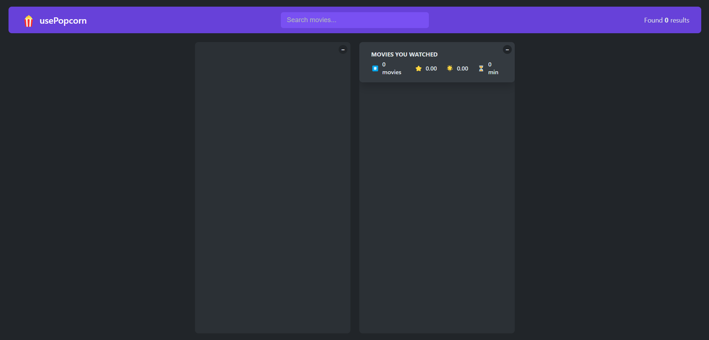
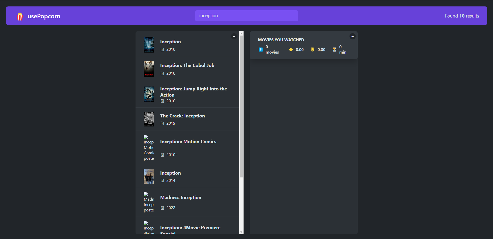
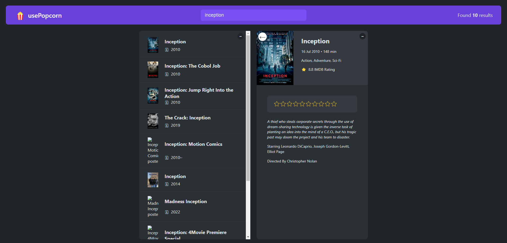
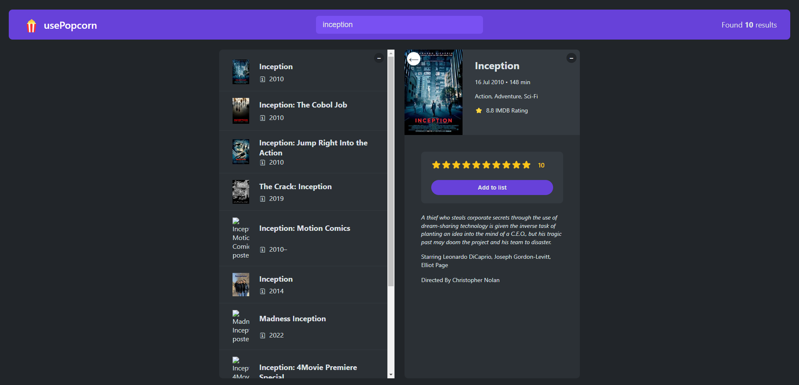
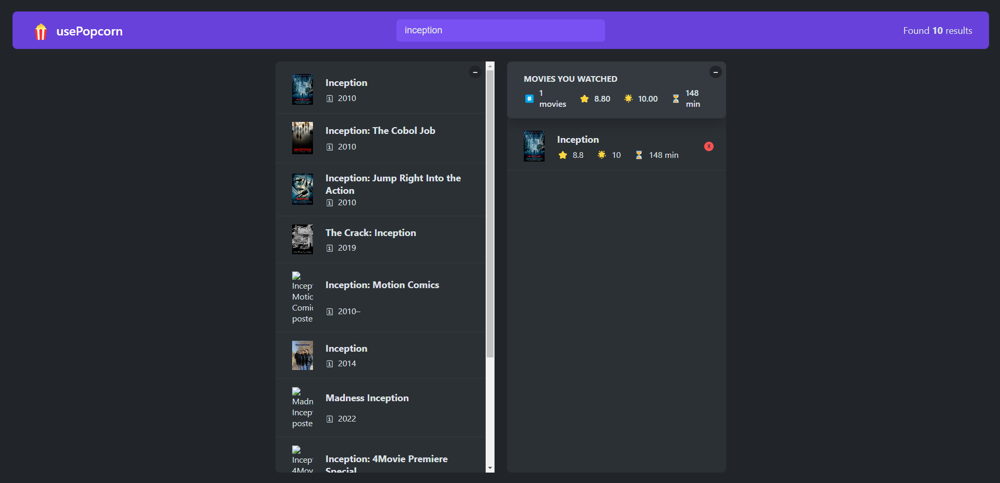
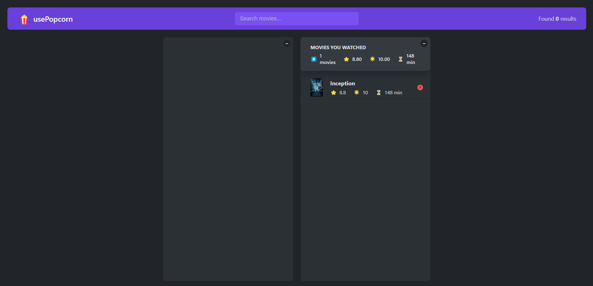

 # ✨ Project Title: UsePopcorn - A Movie Search and Rating React App
 
## 📽️ Overview
Welcome to UsePopcorn, a feature-rich web application designed for movie enthusiasts. UsePopcorn leverages the power of React and the OMDb API to provide users with a seamless experience in searching, rating, and summarizing their watched movies.

## ✨ Key Features 
### 1. Movie Search:
- #### Search Movies by Title:
    - Users can easily search for their favorite movies using the intuitive search feature.
    - Retrieve comprehensive details such as IMDb rating, runtime, and plot description.

### 2. Custom Rating System:
- #### Rate and Save Movies:
     - Express your opinions by rating movies with a custom rating system.
     - User ratings are stored securely in local storage for future reference.
### 3. Watched Movies Summary:
- #### Detailed Summary:
    - Keep track of your movie-watching journey with the Watched Movies Summary feature.
    - Get insights into the average user rating, IMDb rating, and an overall average rating for the movies you've watched.
### 4. Efficient Data Retrieval:
- #### Powered by Axios:
   - UsePopcorn optimizes data retrieval by efficiently utilizing the Axios library in the React app.
   - Enjoy a fast and responsive experience while fetching movie details from the OMDb API.

## 🚀 Getting Started

**1.** Clone the repository using the following command:

    git clone git@github.com:McACE007/UsePopcorn.git

**2.** Install the required dependencies by running the following command in your terminal:

    npm install

**3.** Start the development server by running the following command:

    npm run dev

**4.** Get OMDB API Key:
- Sign up for an API key at [OMDb API](https://www.omdbapi.com/apikey.aspx) and replace it with APIKey in useMovies.js and MovieDetails.jsx.

**5.** To test locally, simply run the following command :

    npm run dev

**6.** When you are ready to deploy, simply run the following command to create a production-ready build:

    npm run build

Step into the movie magic with UsePopcorn! 🍿 Explore the [live demo](https://use-popcorn-rose-nine.vercel.app/) for an effortless movie-searching and rating experience. The app plays well with browsers like Chrome, Firefox, Safari, and Edge. Get ready to discover and rate your favorite movies with UsePopcorn – movie night has never been this fun! 🎬✨

## 📸 Screenshots

| Home Page | Searched Some Movie Title |
|------|-------|
|||

| Movie Details  | Add to Watch List with User Rating |
|------|-------|
|||

| Watched Movies List Before Reload |Watched Movies List After Reload |
|------|-------|
|||
